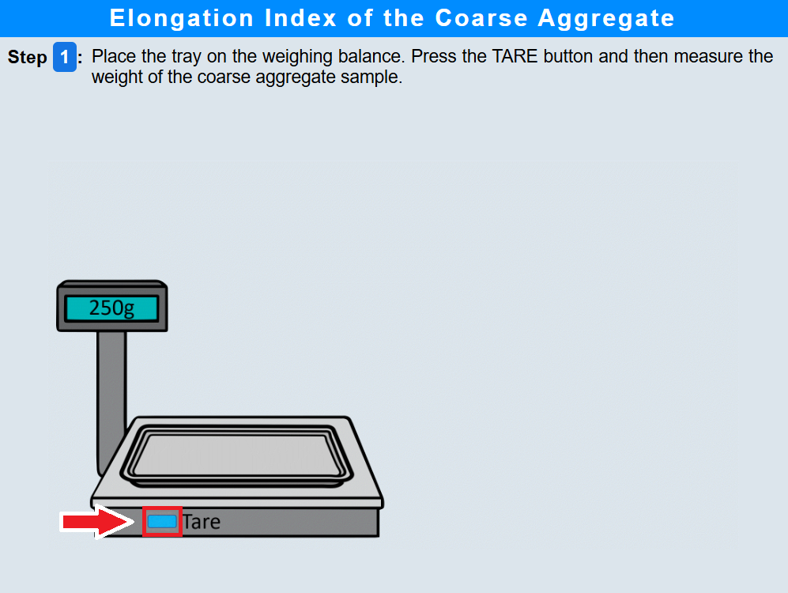
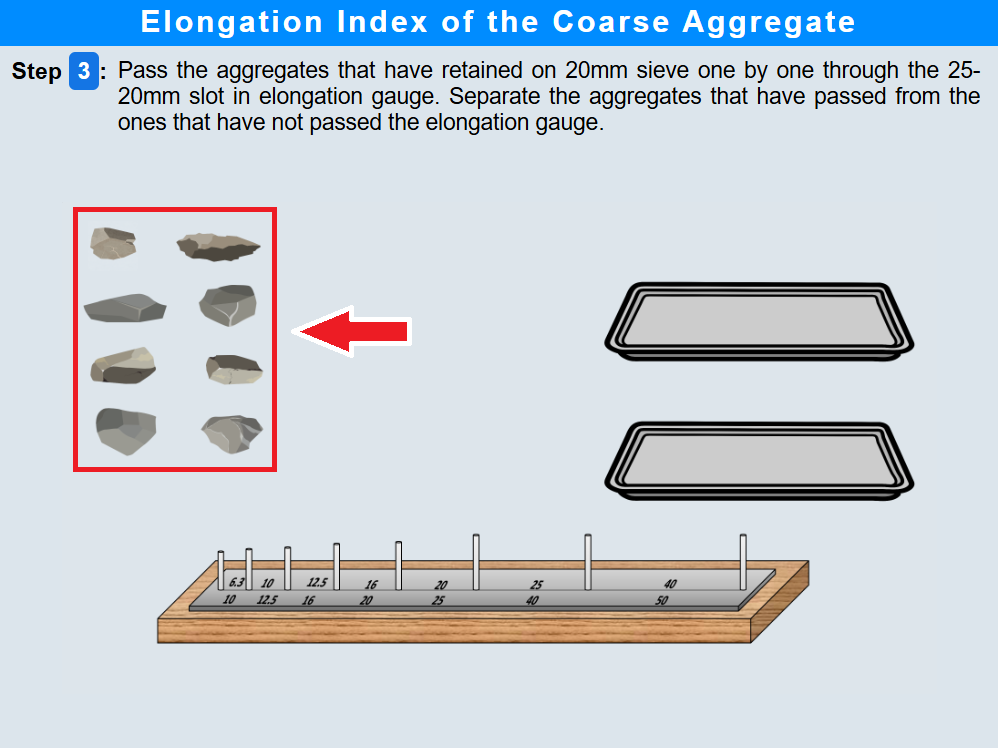
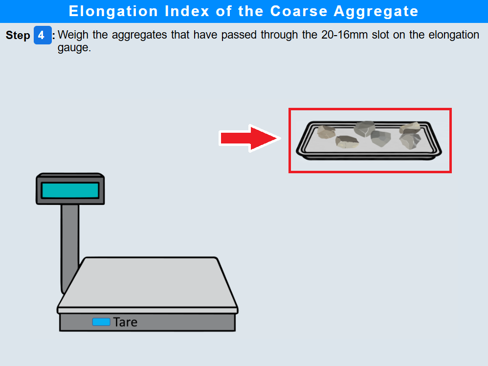
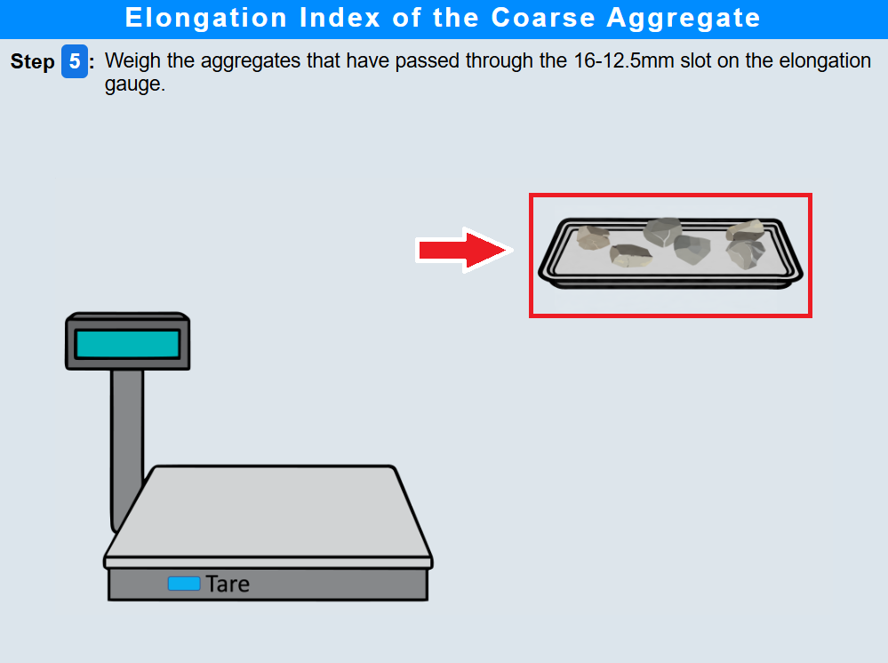
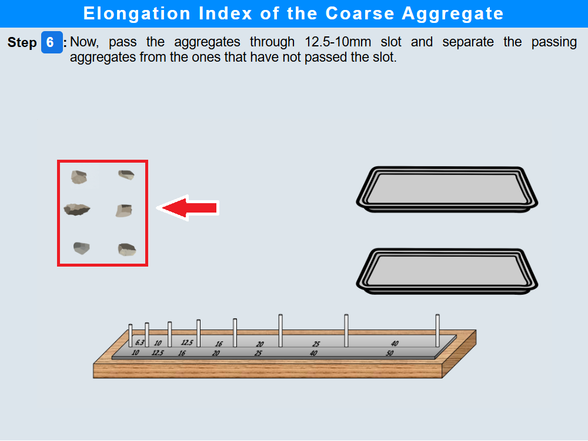
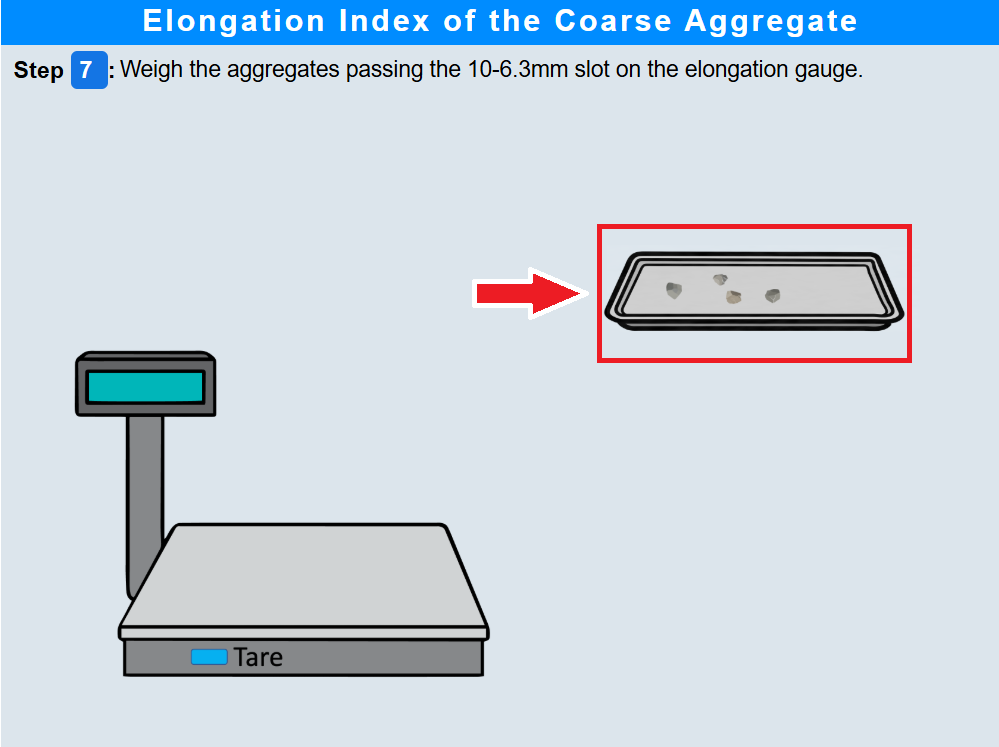

### Procedure

### Step 1: Weighing Coarse Aggregate Sample
•	Click on the tray to place it on the weighing balance.
 
•	Click the "TARE" button to zero the balance .
 
•	Click on the coarse aggregate sample to measure its weight . 
 
•	Click the "Next Step" button.

### Step 2: Preparation for Sieve Analysis of Coarse Aggregates
•	Click on the Assemble button to assemble sieves in descending order. 
 
•	Click on the aggregate sample to pour into the sieve stack . 
 
•	Click on the lid to cover the sieve stack 
      
•	Click on the sieve shaker to place it on the sieve shaker.
 
•	Click on the Tare button to start shaking. 
 
•	Click on the lid to remove sieve from the shaker. 
 
•	Click on the sieve and note down the aggregates.
 
•	Click the "Next Step" button.

### Step 3: Aggregate Size Analysis Using 25–20 mm Gauge
•	Click on each aggregate particle to pass through the 25-20mm gauge. 
 
•	Click on the aggregates tray to weigh passing aggregates.  
 
•	Click the "Next Step" button.

### Step 4: Aggregate Size Analysis Using 20–16 mm Gauge
•	Click on aggregate particles to pass through the 20-16mm gauge.
 
•	Click on the aggregates tray to weigh passing aggregates. 
 
•	Click the "Next Step" button.

### Step 5:Aggregate Size Analysis Using 16.5–12 mm Gauge
•	Click on aggregate particles to pass through the 16.5-12mm gauge.
 
•	Click on the aggregates tray to weigh passing aggregates. 
 
•	Click the "Next Step" button.

### Step 6:Aggregate Size Analysis Using 12.5–10 mm Gauge
•	Click on aggregate particles to pass through the 12.5-10mm gauge.
 
•	Click on the aggregates tray to weigh passing aggregates.
 

### Step 7 : Aggregate Size Analysis Using 10–6.3 mm Gauge
•	Click on aggregate particles to pass through the 10-6.3mm gauge .
 
•	Click on the weighing balance to weigh passing aggregates.
 
•	Click the "Next Step" button.

### Step 8: Results
•	Click the "Show Results" button.
